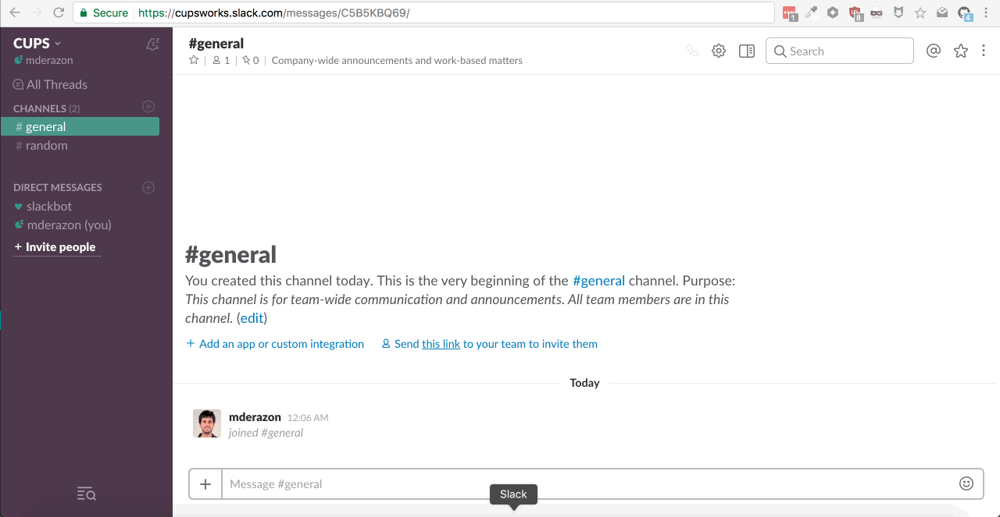

# slack-secret

> Send secure messages in Slack

[](http://standardjs.com/)

<a href="https://slack.com/oauth/authorize?&client_id=2348108152.180459748356&scope=commands,users:read.email,channels:read,users:read,groups:read,im:read" target="_blank"></a>

## Description
A Slack [slash command](https://api.slack.com/slash-commands) that sends a secure message in slack channels.

It uses [sharelock.io](https://sharelock.io) to encrypt the message so that it can only be read by the people in the Slack channel that the message was posted in.



### Tech
- Slack api to create the slash command.
- [Webtask](https://webtask.io) - Cool serverless architecture.
- [Sharelock](https://sharelock.io) - Uses an unofficial and undocumented api to create a link to a message that can only be read by the people in the slack channel the message was created in.
- OAuth - Used to create the "Add to slack" button.

## Use
You can just [add the app](https://slack.com/oauth/authorize?&client_id=2348108152.180459748356&scope=commands,users:read.email,channels:read,users:read,groups:read,im:read) to slack and use it right away in Slack:
```
/secret [some-secret]
```

Or you can host your own webtask instance and run this yourself. To do that, you first need to create a webtask account and use the webtask CLI to create a new app.

Then to push changes to the app you need to
```
$ npm run build
$ npm run deploy
```
The build step inlines all local files into the one entry file and also runs the code through Babel to make it work with the Node runtime version in webtask.

*Note*: there's a way to make webtask bundle other files in the project, but it bundles all external modules as well which results in a very big file that the webtask uploader rejects. See https://github.com/auth0/wt-cli/issues/121

Once you deploy to webtask, there are also two [secret variables](https://webtask.io/docs/editor/secrets) that need to be set:
1. `SLACK_VERIFICATION` - Slack verification code to match the incoming message.
2. `SLACK_SECRET` - The app's secret.
You can get them both from the Slack api dashboard.

## Permissions
The app requests the following Slack permissions:
1. `commands` - To be able to install itself in your team.
2. `channels:read` - To get a list of users in the channel the message was posted in.
3. `groups:read` - To get a list of users in the group the message was posted in.
4. `im:read` - In case of direct message, get the other user.
5. `users:read` - Get the email addresses of the users.
6. `users:read.email` - Email needs to be asked explicitly.
